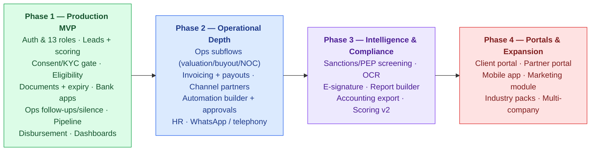

# Bitar Mortgage CRM — End-to-End Process Flow

This document shows how a mortgage case moves through the Bitar CRM from first enquiry to disbursement, revenue and reporting. Every step is tagged with its rollout phase (P1–P4) and marked as built now or planned for a later phase.

---

## Legend

**Rollout phases** (per PRD v1.0 four-phase plan)

| Tag | Phase | Theme |
|---|---|---|
| **P1** | Phase 1 | Production MVP — auth, roles, leads, pipeline, ops core, docs, tasks, dashboards |
| **P2** | Phase 2 | Operational depth — invoicing, partners, automation, HR, WhatsApp/telephony |
| **P3** | Phase 3 | Intelligence & compliance automation — screening, OCR, e-sign, report builder |
| **P4** | Phase 4 | Portals & expansion — client/partner portals, mobile app, industry packs |

**Build status markers**

- ✅ **Built now** — implemented and working in the current application.
- 🔜 **Planned** — designed and scoped, not yet implemented.

In the diagrams, phase is shown by node colour (see `classDef` legend) and build status by the ✅ / 🔜 marker inside each node label.

---

## Main Process Flow

```mermaid
flowchart TD
    %% ---------- Phase color classes ----------
    classDef p1 fill:#DCFCE7,stroke:#16A34A,color:#14532D;
    classDef p2 fill:#DBEAFE,stroke:#2563EB,color:#1E3A8A;
    classDef p3 fill:#EDE9FE,stroke:#7C3AED,color:#4C1D95;
    classDef p4 fill:#FEE2E2,stroke:#DC2626,color:#7F1D1D;

    %% ================= LEAD CAPTURE =================
    subgraph CAP["1 · Lead Capture (P1)"]
        A1["✅ Manual / 7-step wizard entry<br/>(P1)"]
        A2["🔜 Web-to-lead API + spam control<br/>(P1)"]
        A3["🔜 Ad-platform webhooks<br/>Meta / Google (P2)"]
        A4["🔜 Quick-create &lt;10s<br/>(P1)"]
    end

    %% ============ ASSIGN + SCORING ============
    subgraph ASG["2 · Auto-assign + Scoring (P1)"]
        B1["✅ Advisor assignment<br/>manual (P1)"]
        B2["🔜 Assignment rules engine<br/>round-robin / queues (P1)"]
        B3["✅ Rule-based lead score<br/>v1 (P1)"]
        B4["✅ First-contact SLA clock<br/>+ breach flag (P1)"]
        B5["🔜 SLA escalation to TL / SDir<br/>business-hours engine (P1)"]
    end

    %% ============ CONSENT + KYC ============
    subgraph KYC["3 · Consent + KYC (P1)"]
        C1["✅ Per-channel consent<br/>call/SMS/WhatsApp/email (P1)"]
        C2["✅ KYC status gate<br/>Pending/Passed/Rejected (P1)"]
        C3["🔜 Compliance-only hard gate<br/>blocks pre-approval (P1)"]
        C4["🔜 Sanctions / PEP screening<br/>(P3)"]
    end

    %% ============ ELIGIBILITY ============
    subgraph ELG["4 · Eligibility Check (P1)"]
        D1["✅ Instant eligibility result<br/>Green/Amber/Red (P1)"]
        D2["🔜 Full DBR / LTV / cash-to-close<br/>config-driven caps (P1)"]
    end

    %% ============ DOCUMENTS ============
    subgraph DOC["5 · Document Collection (P1)"]
        E1["✅ Upload + verify/reject/reupload<br/>(P1)"]
        E2["✅ Expiry engine<br/>30/14/7-day status (P1)"]
        E3["🔜 Checklist templates<br/>per profile / per bank (P1)"]
        E4["🔜 Secure client upload links<br/>+ virus scan (P2)"]
    end

    %% ============ BANK APPLICATIONS ============
    subgraph BANK["6 · Bank Application(s) — parallel (P1)"]
        F1["✅ Multiple bank apps per case<br/>independent status/refs (P1)"]
        F2["🔜 Per-bank submission checklists<br/>(P1)"]
        F3["🔜 Rejection Pareto + league table<br/>(P1/P3)"]
    end

    %% ============ OPS WORKFLOW ============
    subgraph OPS["7 · Ops Workflow (P1)"]
        G1["✅ Ops queue view<br/>(P1)"]
        G2["✅ Follow-up log + next date<br/>(P1)"]
        G3["✅ Silence rules<br/>3-day warn / 7-day escalate (P1)"]
        G4["🔜 Handover gate + completeness score<br/>(P1)"]
        G5["🔜 Query records + auto chase tasks<br/>(P1)"]
        G6["🔜 Ops subflows: valuation/buyout/NOC/transfer<br/>(P2)"]
    end

    %% ============ PRE-APPROVAL / FOL ============
    subgraph FOL["8 · Pre-Approval / FOL (P1)"]
        H1["✅ Stage tracking<br/>Pre-Approved / FOL Issued / Signed (P1)"]
        H2["🔜 Structured FOL terms<br/>fixed-rate end date, validity (P1)"]
        H3["🔜 E-signature on FOL<br/>(P3)"]
    end

    %% ============ DISBURSEMENT ============
    subgraph DIS["9 · Disbursement (P1)"]
        I1["✅ Disbursed stage + date<br/>+ pipeline month (P1)"]
        I2["🔜 Deed / disbursement capture → finance<br/>(P1)"]
    end

    %% ============ REVENUE ============
    subgraph REV["10 · Revenue (P1/P2)"]
        J1["✅ Customization revenue sheet<br/>slab/VAT/broker payout/final rev (P1 extra)"]
        J2["✅ Finance summary view<br/>(P1)"]
        J3["🔜 Tax invoices + VAT PDF + receipts<br/>+ payout runs (P2)"]
        J4["🔜 Accounting export<br/>Zoho/QuickBooks/Tally (P3)"]
    end

    %% ============ REPORTING / BI ============
    subgraph RPT["11 · Reporting / BI (P1/P3)"]
        K1["✅ CEO / management dashboards<br/>live data (P1)"]
        K2["🔜 All role dashboards + drill-down<br/>(P1)"]
        K3["🔜 Report builder + scheduled exports<br/>(P3)"]
        K4["🔜 Client / partner portals<br/>(P4)"]
    end

    %% ---------- Flow edges ----------
    A1 --> B1
    A2 --> B1
    A3 --> B1
    A4 --> B1
    B1 --> B3 --> B4 --> C1
    B2 -.-> B1
    B5 -.-> B4
    C1 --> C2 --> D1
    C3 -.-> C2
    C4 -.-> C2
    D1 --> E1
    D2 -.-> D1
    E1 --> E2 --> F1
    E3 -.-> E1
    E4 -.-> E1
    F1 --> G1
    F2 -.-> F1
    F3 -.-> F1
    G1 --> G2 --> G3 --> H1
    G4 -.-> G1
    G5 -.-> G2
    G6 -.-> H1
    H1 --> I1
    H2 -.-> H1
    H3 -.-> H1
    I1 --> J1
    I2 -.-> I1
    J1 --> J2 --> K1
    J3 -.-> J2
    J4 -.-> J3
    K1 --> K2
    K3 -.-> K1
    K4 -.-> K1

    %% ---------- Class assignments ----------
    class A1,A2,A4,B1,B2,B3,B4,B5,C1,C2,C3,D1,D2,E1,E2,E3,F1,F2,G1,G2,G3,G4,G5,H1,H2,I1,I2,J1,J2,K1,K2 p1;
    class A3,E4,G6,J3 p2;
    class C4,F3,H3,J4,K3 p3;
    class K4 p4;
```

> Solid arrows = the live end-to-end path. Dotted arrows = capabilities that attach to the same step but are planned for a later phase.

---

## Four-Phase Rollout Overview

---

## How the Flow Works — Plain-Language Walkthrough

- **1. Lead Capture (P1):** A lead is created manually or through the multi-step wizard today. Website-form capture, ad-platform webhooks and quick-create are planned additions.
- **2. Auto-assign + Scoring (P1):** Leads are assigned to an advisor and given a rule-based score, and a first-contact SLA clock starts. A full rules-based assignment engine and automated SLA escalation to Team Leader / Sales Director are planned.
- **3. Consent + KYC (P1):** Per-channel contact consent and a KYC status (Pending / Passed / Rejected) are captured. A Compliance-only hard gate that blocks progress until KYC passes, plus sanctions/PEP screening, are planned.
- **4. Eligibility Check (P1):** The system produces an instant eligibility result on the lead. The full config-driven DBR / LTV / cash-to-close calculation is planned.
- **5. Document Collection (P1):** Documents are uploaded, verified, rejected and re-uploaded, with an expiry engine flagging documents nearing expiry. Per-bank checklist templates and secure client upload links are planned.
- **6. Bank Applications — parallel (P1):** A case can carry several bank applications at once, each with its own status and reference. Per-bank submission checklists and rejection/league analytics are planned.
- **7. Ops Workflow (P1):** Operations works from a queue, logs follow-ups with a mandatory next date, and the silence rules warn at 3 days and escalate at 7 days of no activity. Handover gate, query records with auto chase tasks, and the valuation/buyout/NOC/transfer subflows are planned.
- **8. Pre-Approval / FOL (P1):** Stage tracking already covers Pre-Approved, FOL Issued and FOL Signed. Structured FOL terms (fixed-rate end date, validity) and e-signature are planned.
- **9. Disbursement (P1):** The disbursed stage, disbursement date and pipeline month are captured today. A structured deed/disbursement handoff into finance is planned.
- **10. Revenue (P1 / P2):** The Customization revenue sheet computes actual revenue, VAT, broker payout and final revenue, alongside a finance summary. Formal tax invoicing (VAT PDF, receipts, payout runs) is Phase 2; accounting-system export is Phase 3.
- **11. Reporting / BI (P1 / P3):** CEO and management dashboards run on live data today. Completing all role dashboards with drill-down is Phase 1; a self-service report builder with scheduled exports is Phase 3; client and partner portals are Phase 4.
